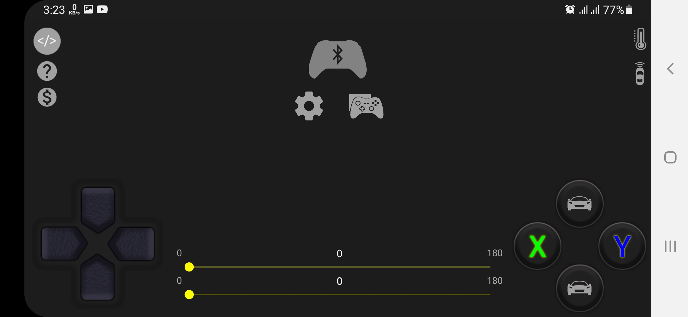
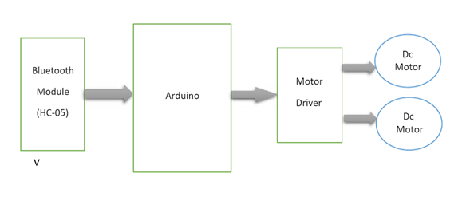
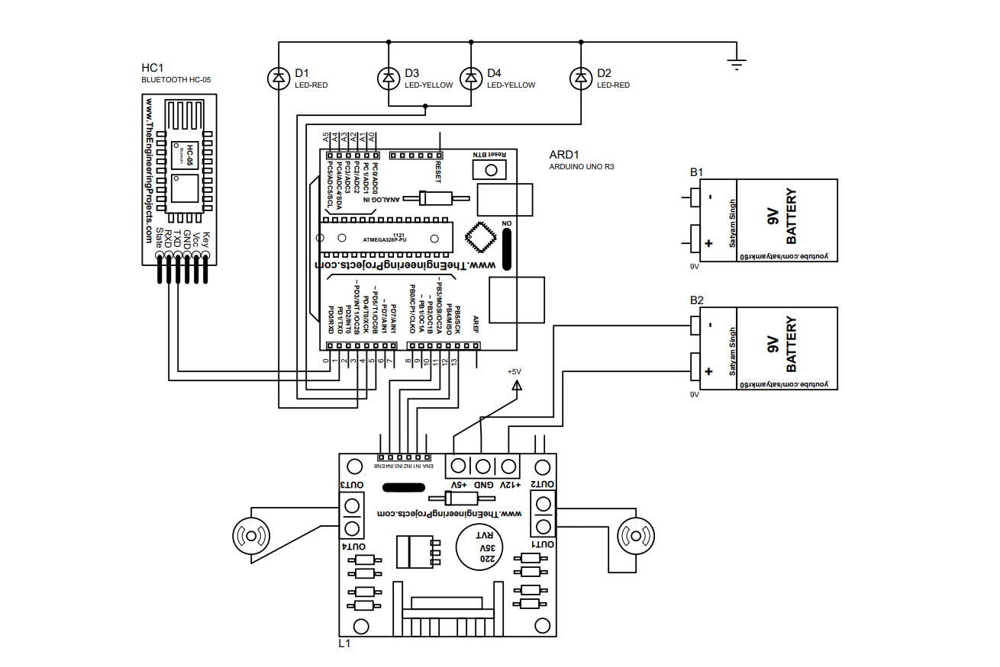
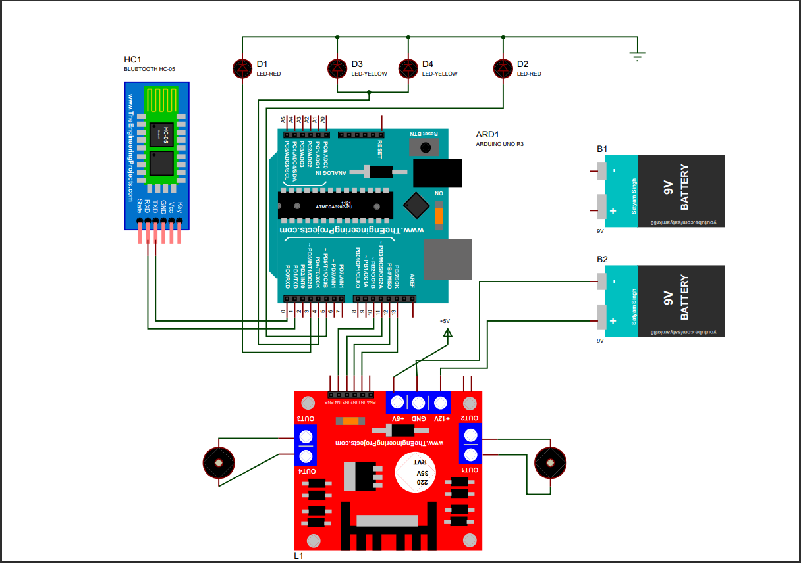
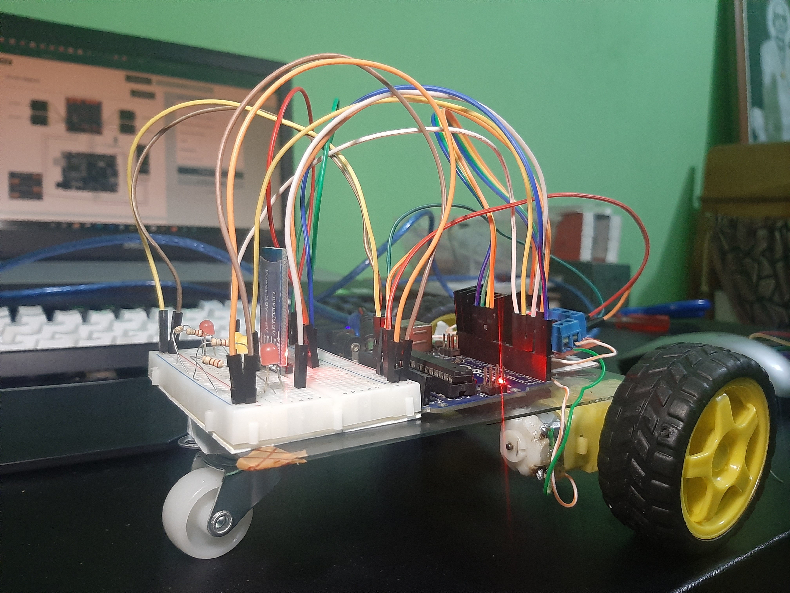
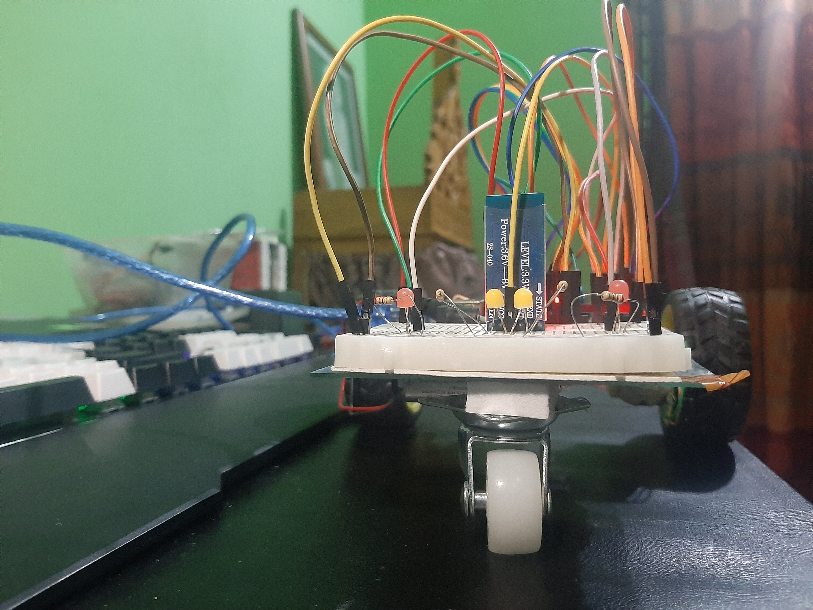
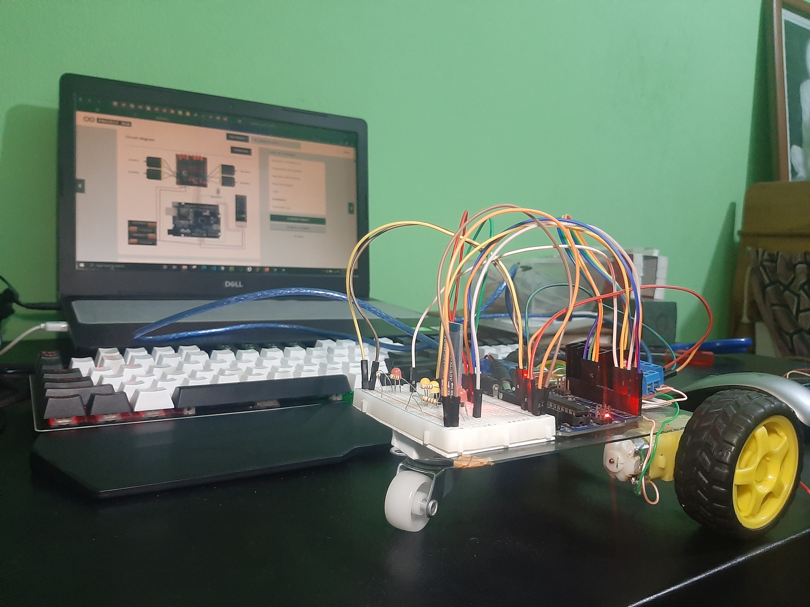
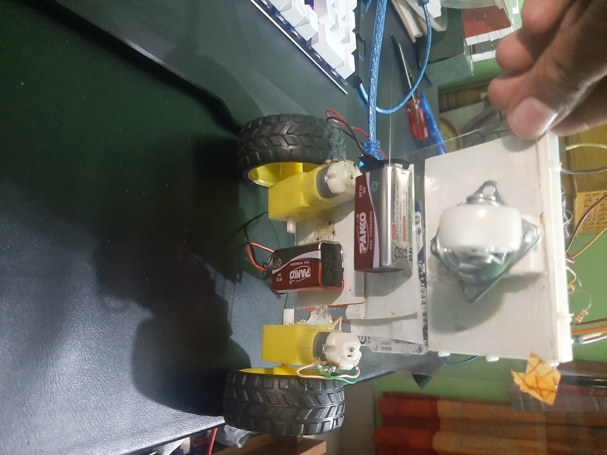

`Shuva Das`<br/>
**`B. Sc.  in CSE`**
---
# Bluetooth Controlled Vehicles using Arduino Uno R3 and HC-05 Bluetooth Controller
---


`#Problem Statement:`
---
---
<p>
A remote controlled vehicle is any mobile machine controlled by means that is physically not connected with origin external to the machine. There are many types in it, based on the controls radio control device, Wi-Fi controlled and even Bluetooth controlled. These devices are always controlled by humans and take no action autonomously. The main target in such vehicles would be to safely reach a designated point, maneuver the area and reach back to the point of origin. 
</p>

<br/>

`#Motivation:`
---
---
<p>
In this project we make use of the Bluetooth technology to control our machine 
car. We don’t call this as a robot as this device doesn’t have any sensors. 
Thereby, sensor less robots are machines. This machine can be controlled by 
any human using his android mobile phone, by downloading an app and connecting 
it with the Bluetooth module present inside our car. User can perform actions 
like moving forward, backward, moving left and right by the means of command 
using his-her mobile phone app. The task of controlling our car is taken car by 
the Arduino UNO with micro controller ATMEGA32. Arduino play a major role in the control section and had made it easier to convert digital 
signals and analogue signals into physical movements. The major reason for using 
a Bluetooth based tech is that we can change the remote anytime – mobiles 
phones, tablets and laptops and physical barriers like wall or doors do not affect 
the car controls.
</p>

<br/>

`#Software tools: `
---
---

1. Arduino Bluetooth Controller Application (Arduino Car -- On Playstore)
    
2. Arduino software
    
3. Proteus 8 Professional (for Drawing and testing the circuit)

    <br>
    `Added Library on Proteus`
    ---
    1. Arduino Uno R3
    2. HC-05 Module
    3. L298 module
    4. Battery

<br/>

`#Hardware Tools: `
---
---
1. Arduino Uno R3
2. HC-05 Bluetooth Module
3. L298 Motor Driver
4. 6V DC Motor^2
5. 2 Wheels and 1 Adjusted Wheel
7. Jumper Wire
8. 9V Battery^2 with Connector
9. LED (RED^2, YELLOW^2)
10. Android Phone


<br/>

`#System Design: Block Diagram`
---
---



<br/>

`#Cercuit Diagram:`
---
---




<br/>

`#Source Code:`
---
---

```html
char t;
 
void setup() {
pinMode(13,OUTPUT);   //left motors forward
pinMode(12,OUTPUT);   //left motors reverse
pinMode(11,OUTPUT);   //right motors forward
pinMode(10,OUTPUT);   //right motors reverse
pinMode(3,OUTPUT);   //Led left
pinMode(4,OUTPUT);   //Led head
pinMode(5,OUTPUT);   //Led right
Serial.begin(9600);
 
}
 
void loop() {
if(Serial.available()){
  t = Serial.read();
  Serial.println(t);
}
 
if(t == 'F'){            //move forward(all motors rotate in forward direction)
  digitalWrite(4,HIGH);
  digitalWrite(13,HIGH);
  digitalWrite(11,HIGH);
}
 
else if(t == 'G'){      //move reverse (all motors rotate in reverse direction)
  digitalWrite(3,HIGH);
  digitalWrite(5,HIGH);
  digitalWrite(12,HIGH);
  digitalWrite(10,HIGH);
}
 
else if(t == 'L'){      //turn right (left side motors rotate in forward direction, right side motors doesn't rotate)
  digitalWrite(3,HIGH);
  digitalWrite(11,HIGH);
}
 
else if(t == 'R'){      //turn left (right side motors rotate in forward direction, left side motors doesn't rotate)
  digitalWrite(5,HIGH);
  digitalWrite(13,HIGH);
}

else if(t == 'S'){      //STOP (all motors stop)
  digitalWrite(13,LOW);
  digitalWrite(12,LOW);
  digitalWrite(11,LOW);
  digitalWrite(10,LOW);
  digitalWrite(3,LOW);
  digitalWrite(4,LOW);
  digitalWrite(5,LOW);
}
delay(100);
}
```
---
---


<br/>

`#System Implementation & System Testing: Snapshot`
---
---





<br/>

`#Conclusion:`
---
---
<p>
The final product we obtained is just the skeleton of those Remote Control Cars we see in the market. The mechanical design of this product is also proposed, which could be practically made to give a much better-looking commercial product. For future plans, this product could be added with sensors like, accelerometer and humidity sensor, thereby widening their field of use. The present product however could show some latency. The reason is, due to many connections and least power source of 6V, which result in loss of energy. So in future, we could use rechargeable batteries like Ni-Cd Battery or Li-ion battery that could avoid the present disadvantage. 
</p>

<br/>


### Resource from

https://create.arduino.cc/projecthub

### Team Member

| Name                 | Id                     |
| ------------         | ---------------------- |
| Shuva Das            | CSE 01806736           |
| S.M. Minhajur Rahman | CSE 01806699           |
| Rakib Hossain        | CSE 01806703           |
| Anisur Rahman        | CSE 01806718           |
| Shah Aziz Chowdhury  | CSE 01806729           |


<!-- all link is here -->
### [Facebook:]
https://www.facebook.com/ShuvaDas.CSE/

[websitelink]: https://github.com/Shuva-Das
[facebooklink]: https://www.facebook.com/ShuvaDas.CSE/

